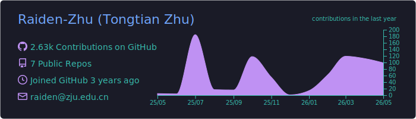
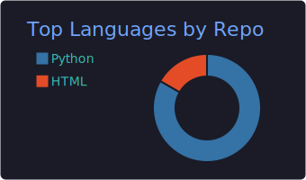
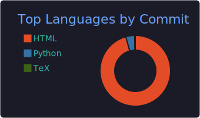
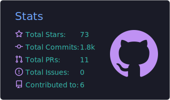

<!--
Raiden-Zhu/Raiden-Zhu is a ✨ _special_ ✨ repository because its `README.md` (this file) appears on your GitHub profile.

Here are some ideas to get you started:

- 🔭 I’m currently working on ...
- 🌱 I’m currently learning ...
- 👯 I’m looking to collaborate on ...
- 🤔 I’m looking for help with ...
- 💬 Ask me about ...
- 📫 How to reach me: ...
- 😄 Pronouns: ...
- ⚡ Fun fact: ...
-->

### Short Bio 😄
👋 Hi there. I am Tongtian Zhu, a PhD student at the Computer Science Department of [Zhejiang University (ZJU)](https://person.zju.edu.cn/en/msong](https://www.zju.edu.cn/english/)), supervised by Professors [Can Wang](https://person.zju.edu.cn/en/wangcan) and [Chun Chen](https://person.zju.edu.cn/en/0082004). <!-- I earned my B.S. degree in Mathematical Science from CUMTB, as well as my B.Econ. degree in Economics (double degree) from [Peking University](https://english.pku.edu.cn/) (PKU) in 2021. --> 

### [Link to My Homepage](https://raiden-zhu.github.io/) 🤗 

<i class="ai ai-google-scholar"></i> [**Google Scholar**](https://scholar.google.com/citations?user=QvBDUsIAAAAJ&hl=en) &nbsp;&nbsp; <!--<i class="fa fa-twitter"></i> [**Twitter**](https://twitter.com/Raiden13238619/) &nbsp;&nbsp;--> <i class="fa fa-envelope"></i> [**Email**](mailto:raiden@zju.edu.cn) &nbsp;&nbsp; <i class="fa fa-weixin"></i> [**WeChat**](https://raw.githubusercontent.com/Raiden-Zhu/Raiden-Zhu.github.io/master/assets/img/WeChat_QR_code.jpg) &nbsp;&nbsp;  <i class="fab fa-zhihu"></i> [**Zhihu**](https://www.zhihu.com/people/you-li-70-94) 

### Research Interest 🦄
My primary research interest lies in understanding the fundamental mechanisms underpinning the practical success of deep learning, including LLMs. I am also interested in developing machine learning methodologies inspired by principles. My current research focuses on examining the theoretical foundations of **decentralized learning**.

Please feel free to contact me via **email (📫 raiden@zju.edu.cn)** or **WeChat (RaidenT_T)** if you have any questions 💬, are interested in collaborating, or simply want to chat.

  
  
  
  

