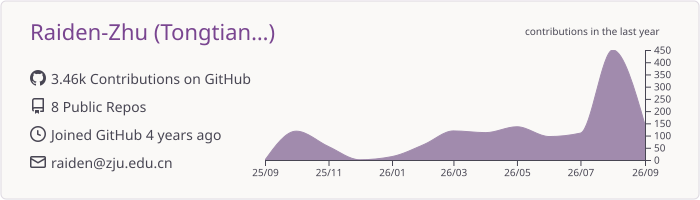
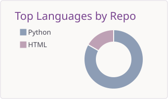
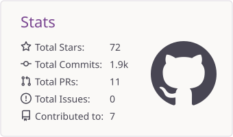

<!--
Raiden-Zhu/Raiden-Zhu is a ✨ _special_ ✨ repository because its `README.md` (this file) appears on your GitHub profile.

Here are some ideas to get you started:

- 🔭 I’m currently working on ...
- 🌱 I’m currently learning ...
- 👯 I’m looking to collaborate on ...
- 🤔 I’m looking for help with ...
- 💬 Ask me about ...
- 📫 How to reach me: ...
- 😄 Pronouns: ...
- ⚡ Fun fact: ...
-->

## Hi, I'm Tongtian Zhu

I am a Ph.D. candidate at the Computer Science Department of [Zhejiang University (ZJU)](https://www.zju.edu.cn/english/), supervised by Professors [Can Wang](https://person.zju.edu.cn/en/wangcan) and [Chun Chen](https://person.zju.edu.cn/en/0082004).

[**Homepage ↗**](https://raiden-zhu.github.io/) &nbsp; · &nbsp; [Google Scholar](https://scholar.google.com/citations?user=QvBDUsIAAAAJ&hl=en) &nbsp; · &nbsp; [Email](mailto:raiden@zju.edu.cn) &nbsp; · &nbsp; [WeChat](https://raw.githubusercontent.com/Raiden-Zhu/Raiden-Zhu.github.io/master/assets/img/WeChat_QR_code.jpg) &nbsp; · &nbsp; [Zhihu](https://www.zhihu.com/people/you-li-70-94)

### Research interests
My research focuses on understanding learning mechanisms and developing methods grounded in these insights. I am particularly interested in:

- **Language model training** — optimizers, looped architectures, and efficient parallelism.
- **Decentralized learning** — [training dynamics](https://arxiv.org/abs/2306.02913), [generalization](https://arxiv.org/abs/2206.12680), [data influence](https://openreview.net/forum?id=2TIYkqieKw), and [communication allocation](https://openreview.net/forum?id=lWGMbJRCtQ).
- **Foundations of deep learning** — [learning dynamics / implicit bias](https://arxiv.org/abs/2306.02913), [symmetries](https://arxiv.org/abs/2406.09189), and [emergence of mergeability](https://openreview.net/forum?id=lWGMbJRCtQ).

Feel free to [email me](mailto:raiden@zju.edu.cn) to discuss research or collaboration.

### Open-source activity

<picture>
  <source media="(prefers-color-scheme: dark)" srcset="./assets/profile/dark/0-profile-details.svg">
  
</picture>
<picture>
  <source media="(prefers-color-scheme: dark)" srcset="./assets/profile/dark/1-repos-per-language.svg">
  
</picture>
<picture>
  <source media="(prefers-color-scheme: dark)" srcset="./assets/profile/dark/3-stats.svg">
  
</picture>
